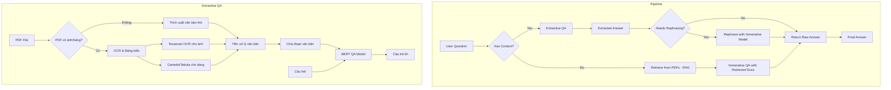

# PyTorch Workflow

```mermaid
flowchart TD
    subgraph OV[Pipeline]
        A[User Question] --> B{Has Context?}
        B -- Yes --> C[Extractive QA]
        B -- No --> R[Retrieve from PDFs - RAG]
        R --> D[Generative QA with Retrieved Docs]
        C --> E[Extracted Answer]
        E --> F{Needs Rephrasing?}
        F -- Yes --> G[Rephrase with Generative Model]
        F -- No --> H[Return Raw Answer]
        G --> H
        D --> H
        H --> I[Final Answer]
    end
    subgraph EX[Extractive QA]
        A1[PDF File] --> B1{PDF có ảnh/bảng?}
        B1 -- Có --> C1[OCR & Bảng biểu]
        B1 -- Không --> D1[Trích xuất văn bản thô]
        C1 --> C11[Tesseract OCR cho ảnh]
        C1 --> C21[Camelot/Tabula cho bảng]
        D1 --> E1[Tiền xử lý văn bản]
        C11 & C21 --> E1
        E1 --> F1[Chia đoạn văn bản]
        F1 --> G1[BERT QA Model]
        H1[Câu hỏi] --> G1
        G1 --> I1[Câu trả lời]
    end
```